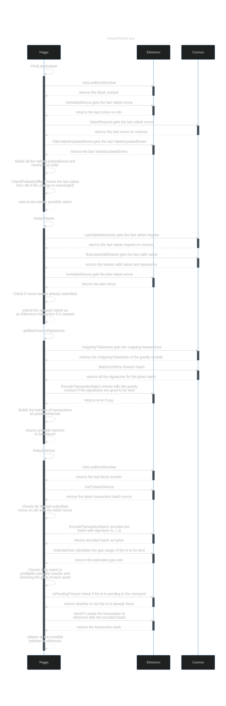

# Peggo diagrams

- All the peggo main loops are going to have an specific diagram associated
with it
- All the diagrams were made using [mermaid](https://mermaid-js.github.io/mermaid/#/)
- Can be edited in [mermaid.live](https://mermaid.live/)

## Loops

### EthOracleMainLoop

- The `EthOracleMainLoop` responsible for making sure that Ethereum events are
retrieved from the Ethereum blockchain and ferried over to Cosmos where they
will be used to issue tokens or process batches

- Code for this diagram is in `diagrams/loop_EthOracleMainLoop.mermaid`

### BatchRequesterLoop

- This loop really means that peggo checks with umee if there is any batch of tokens
 that needs to be batched to ethereum (It doesn't actually sends that batch) it just
 request to cosmos that this batch is built to be bridged in another loop

- This loop is where peggo looks at the BatchFees and uses the query endpoint `BatchFees`
 to iterate over the send to Eth tx pool for each token type, the relayer can then
 observe the price for the ERC20 tokens being relayed on a dex and compute the gas
 cost of executing the batch (via `eth_call()`) as well as the gas cost of
 liquidating the earnings on a dex if desired. Once a relayer determines that a
 batch is good and profitable it can send a `MsgRequestBatch` and the batch will
 be created for the relayer to relay.

- `MsgRequestBatch` is a message anyone can send that requests a batch of transactions
 to send across the bridge be created for whatever block height this message is
 included in. This acts as a coordination point, the handler for this message
 looks at the `AddToOutgoingPool` tx's in the store and generates a batch, also
 available in the store tied to this message. The validators then grab this batch,
 sign it, submit the signatures with a MsgConfirmBatch before a relayer
 can finally submit the batch

- Code for this diagram is in `diagrams/loop_BatchRequesterLoop.mermaid`

### EthSignerMainLoop

- The `EthSignerMainLoop` responsible for making sure that transaciton batches
and validator set are signed and confirmed and sent to the cosmos so that
afterwards they can be relayed and sent to the ethereum smartcontract

- Code for this diagram is in `diagrams/loop_EthSignerMainLoop.mermaid`

### RelayerMainLoop

- The `RelayerMainLoop` responsible for getting the latest valset available
and updating it on the ethereum smartcontract if needed. Also gets all the pending
transaction batches and it's signatures from cosmos and send it to the ethereum if
that batch of token is profitable, wasn't sent yet by another node (checking the
nonce) and it is not currently in the eth node node mempool.

- Code for this diagram is in `diagrams/loop_RelayerMainLoop.mermaid`
