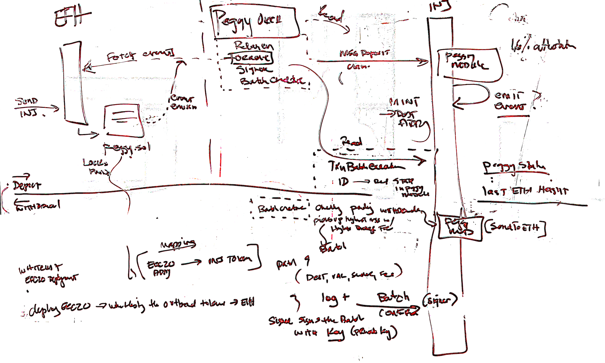

# Peggo Architecture

## Orchestrator's Relayer Mode

Runs orchestrator processes that only relay specific messages that do not require a validator's signature. This mode is run alongside a non-validator injective node.

1. `runRelayer` is the main entry point that starts the relayer loop running every 5 minutes. It checks if either valset or batch relaying is enabled in the config.

2. The main relay flow happens in the `relay` method which:
   * Gets the latest Ethereum valset
   * Runs valset and batch relaying in parallel if enabled (both have a config option)

3. Valset relaying (`relayValset`):
   * Fetches latest valsets from Injective chain
   * Gets confirmations for each valset
   * Checks if valset should be relayed using `shouldRelayValset`
   * Sends valset update to Ethereum if conditions are met

4. Batch relaying (`relayTokenBatch`):
   * Gets latest transaction batches from Injective chain
   * Checks batch timeouts against Ethereum height
   * Gets batch signatures
   * Verifies if batch should be relayed using `shouldRelayBatch`
   * Sends transaction batch to Ethereum if conditions are met

5. Helper methods:
   * `findLatestValsetOnEth` - Searches Ethereum events to find most recent valset
   * `shouldRelayValset` - Checks nonce and time offset conditions for valset relay
   * `shouldRelayBatch` - Checks nonce and time offset conditions for batch relay
   * `checkIfValsetsDiffer` - Validates consistency between Injective and Ethereum validator sets

6. Batching process that runs in parallel with relayer:
   * See [Batch Creator Process](#batch-creator-process) for more details.

## Orchestrator's Validator Mode

This mode is specifically designed to run alongside a validator Injective node, as opposed to the more limited relayer mode which only runs the batch creator and relayer processes.

Runs 4 key parallel processes for orchestrating the Peggy bridge:

1. Oracle Process (`runOracle`):
   * Starts from `lastObservedEthHeight` height
   * Monitors and processes events from Ethereum
   * See [Oracle Process](#oracle-process) for more details.

2. Signer Process (`runSigner`):
   * Takes `peggyContractID` as input
   * Handles signing of validator messages and transactions
   * See [Signer Process](#signer-process) for more details.

3. Batch Creator Process (`runBatchCreator`):
   * Creates batches of transactions to be processed
   * Manages transaction batching logic
   * See [Batch Creator Process](#batch-creator-process) for more details.

4. Relayer Process (`runRelayer`):
   * Handles relaying of messages between chains
   * Manages cross-chain communication
   * See [Orchestrator's Relayer Mode](#orchestrators-relayer-mode) for more details.

## Oracle Process

Retrieves Ethereum events from the Ethereum blockchain and brodcasts event claims to Injective where they're used to issue tokens or process batches.

### Key Configuration Parameters

* `ethBlockConfirmationDelay = 12` - Minimum confirmations needed for an Ethereum block to be considered valid
* `defaultBlocksToSearch = 2000` - Maximum block range for Ethereum event query
* `resyncInterval = 24 hours` - Auto re-sync interval to catch up with validator's last observed event nonce

### Event Processing Flow

* Starts from `lastObservedEthBlock` height (fetched via `getLastClaimBlockHeight` from Injective)
* Verifies validator is in the active set before making claims
* Ensures minimum block confirmations
* Retrieves and processes events in batches within defaultBlocksToSearch range
* Sorts events by nonce and filters out already processed ones
* Sends new event claims to Injective chain

### Types of Events Handled

* Legacy Deposit Events (`SendToCosmos`)
* Deposit Events (`SendToInjective`)
* Withdrawal Events (`TransactionBatchExecuted`)
* ERC20 Deployment Events
* Valset Update Events

### Auto-Resync Mechanism

Implemented to handle cases where event nonce falls behind due to:

* Ethereum indexing delays
* Failed claims during validator UnBonding state
* Missed events due to infrastructure issues (e.g., Infura call failures)

`getLastClaimBlockHeight` function is used to retrieve the last observed Eth event nonce from Cosmos.

### Safety Features

* Ensures events are processed in sequence by checking nonce continuity
* Implements retry mechanisms for network operations
* Adds delays between event claims to ensure proper transaction ordering
* Maintains event order through sorting by nonce

## Signer Process

### Validator Set Signing

* Checks for unsigned validator sets using OldestUnsignedValsets
* Signs off on any new validator set updates that haven't been signed yet
* Confirms valset updates on Injective chain with validator's signature
* Logs the confirmation with nonce and number of validators

### Batch Transaction Signing

* Looks for the oldest unsigned transaction batch using OldestUnsignedTransactionBatch
* Signs any new transaction batches that require signatures
* Confirms batches on Injective chain with validator's signature
* Logs confirmations with token contract, batch nonce, and number of transactions

### Key aspects of the Signer Process

* Runs on a default loop duration checking for items to sign
* Takes input directly from a trusted Injective node
* Assumes validity of batches and validator sets from the trusted node
* Uses retry mechanisms for reliability
* Requires both Ethereum address and Peggy ID for signing operations
* Reports metrics for monitoring and timing
* Operates as part of the main Orchestrator process

## Batch Creator Process

The BatchCreator runs as a loop with a default duration (60 seconds) checking for unbatched transactions

### Flows

* `runBatchCreator`: Initializes and starts the batch creator loop
* `requestTokenBatches`: Main loop function that processes unbatched tokens
* `getUnbatchedTokenFees`: Retrieves pending unbatched tokens with their fees
* `requestTokenBatch`: Handles individual token batch requests
* `checkMinBatchFee`: Validates if batch fees meet minimum USD threshold

### Key aspects

* Monitors unbatched token withdrawals waiting to be processed
* Checks token prices against configured minimum batch fee in USD
* Supports custom ERC20 contract mapping to Injective denominations
* Uses price feeds to determine USD values of fees
* Implements retry logic for network operations

### Fee validation

* Converts token amounts using proper decimals
* Multiplies by current token USD price (CoinGecko)
* Compares against minimum configured batch fee threshold
* Only processes batches that meet minimum fee requirements

### Metrics

* Reports function calls and timing
* Logs batch creation events and fee checks
* Provides debugging information for fee calculations

## Injective Broadcast Client

1. `UpdatePeggyOrchestratorAddresses`
   * Allows validators to delegate voting responsibilities to a key
   * Sets the Ethereum address that represents validators on the Ethereum side
   * Validators must sign their Injective address using their submitted Ethereum address

2. `SendValsetConfirm`
   * Used by validators to submit signatures over validator set at a given block height
   * Requires validator to first set Ethereum address
   * When 66% of voting power submits signatures, they can be used to update validator set on Ethereum

3. `SendBatchConfirm`
   * Validators observe batch requests and form batches by ordering transactions by fee
   * Includes validator's Ethereum signature over the batch
   * Batches are cut off at max size or when transactions stop being profitable

4. `SendToEth`
   * User-initiated message to bridge assets
   * Removes tokens from user's balance immediately
   * Has two layers of fees: bridge fee and chain fee

5. `SendRequestBatch`
   * Anyone can request creation of a transaction batch
   * Acts as coordination point for cross-chain transfers
   * Handler generates batch from pending transactions
   * Validators sign batch before relayer submits it

6. `SendDepositClaim`
   * Claims deposits from Ethereum to Cosmos
   * When >66% validators confirm seeing deposit, coins are issued on Injective side
   * Includes event details like sender, receiver, amount and token contract

7. `SendWithdrawalClaim`
   * Claims execution of withdrawal batch on Ethereum
   * Confirms batch of withdrawal operations completed on bridge contract

8. `SendValsetClaim`
   * Claims validator set updates on Ethereum
   * Includes new validator powers and addresses
   * Tracks reward distribution

9. `SendERC20DeployedClaim`
   * Claims deployment of new ERC20 token contracts
   * Records token details like name, symbol, decimals
   * Maps Injective denoms to Ethereum token contracts
